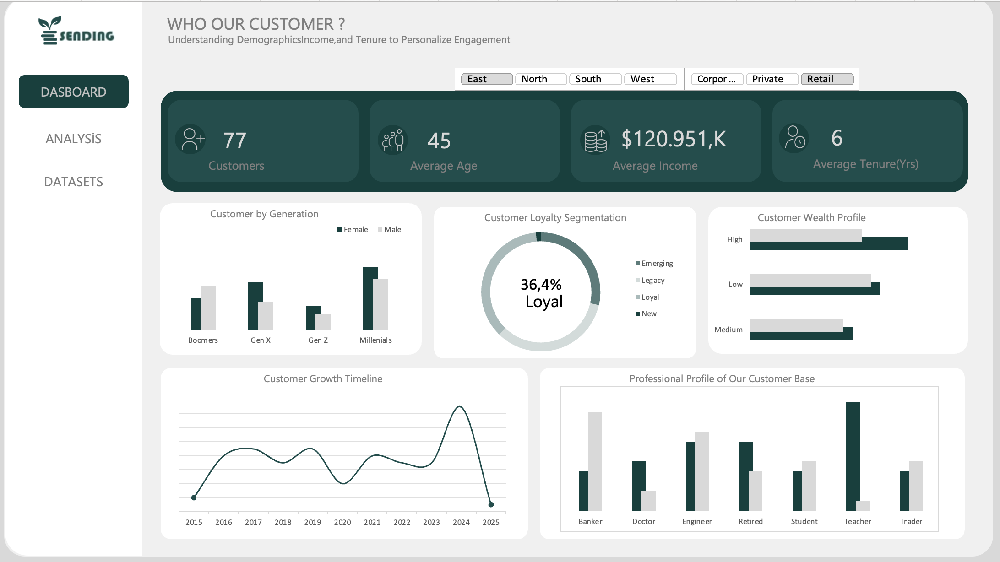

# 👥 Excel & Power Query ile Dinamik Müşteri Segmentasyonu Dashboard

Bu proje; ham müşteri verilerinin uçtan uca işlenerek (ETL), anlamlı demografik, finansal ve sadakat segmentlerine ayrılmasını ve karar vericiler için etkileşimli bir analitik panele dönüştürülmesini içerir. Projede veri temizleme aşamasından profesyonel görselleştirmeye kadar modern Excel veri analitiği araçları etkin bir şekilde kullanılmıştır.

---

## 🚀 Uygulanan Teknik Adımlar & Yetkinlikler

### 1. Veri Hazırlığı ve ETL Süreçleri (Power Query)
* **Veri Aktarımı & Temizliği:** Ham CSV/Text formatındaki müşteri verileri Power Query ortamına aktarılarak tutarsız değerler, boşluklar ve hatalı formatlar temizlendi (`Replace Values`).
* **Segmentasyon Mantığı:** `Conditional Column` (Koşullu Sütun) yapısı kurgulanarak, müşteriler yaş gruplarına (Age Brackets) ve gelir seviyelerine (Income Brackets) göre dinamik olarak segmentlere ayrıldı.

### 2. Veri Analizi & Formülasyon (Pivot Tables & İleri Düzey Formüller)
* Müşteri kitlelerinin genel eğilimlerini, harcama alışkanlıklarını, sadakat durumlarını (Loyalty) ve şirkette kalma sürelerini (Tenure) özetlemek için çoklu **Pivot Tablolar** kurgulandı.
* En yüksek müşteri yoğunluğuna sahip veya en yüksek ciro getiren segmenti dinamik olarak tespit etmek ve KPI alanına otomatik yazdırmak için `INDEX` (İndis) ve `MATCH` (Kaçıncı) fonksiyonları kombinasyon halinde kullanıldı.

### 3. Dashboard Tasarımı & UI/UX Yönetimi
* **Wireframing:** Grafik ve metin kutularının yerleşimi için panel tasarlanmadan önce Excel üzerinde iskelet (wireframe) yerleşimi yapıldı.
* **Renk Paleti & Görsel Dil:** Profesyonel ve kurumsal bir görünüm elde etmek adına `Image Color Picker` aracı kullanılarak uyumlu renk kodları belirlendi ve `Flaticon` üzerinden amaca uygun ikonlar entegre edildi.
* **Dinamik KPI Kartları:** Önemli metriklerin (Toplam Müşteri, Ortalama Gelir vb.) anlık güncellenmesi için metin kutularına hücre referansları (`Cell Referencing`) verilerek dinamik yapılar oluşturuldu.
* **Etkileşimli Filtreleme:** Kullanıcıların veriyi tek tıkla Yaş, Gelir veya Sadakat seviyesine göre kırabilmesi için gelişmiş **Dilimleyiciler (Slicers)** eklenerek rapor tamamen interaktif hale getirildi.

---

## 📁 Proje Yapısı ve Mimari

Proje mantıksal olarak şu aşamalardan oluşmaktadır:
1. **`Data Cleaning / Power Query`:** Verinin ham halden işlenmiş ve modellenmiş hale geçiş adımları.
2. **`Pivot Analysis`:** Segment bazlı özet istatistiklerin ve metriklerin hesaplandığı mutfak kısmı.
3. **`Interactive Dashboard`:** KPI kartları, dinamik grafikler ve dilimleyicilerin yer aldığı, karar vericilere yönelik tasarlanmış nihai kullanıcı ekranı.

---

## 🛠️ Kullanılan Teknolojiler ve Araçlar

* **Ana Araç:** Microsoft Excel
* **Veri İşleme (ETL):** Power Query (Conditional Columns, Value Replacement, Data Type Formatting)
* **Analiz:** Pivot Tables, `INDEX`, `MATCH`, Hücre Referanslı Dinamik Metin Kutuları
* **Görselleştirme:** Dinamik Grafik Tasarımları, Dilimleyiciler (Slicers), Özelleştirilmiş Şekiller ve İkonlar

---
💡 *Not: Projenin interaktif özelliklerini ve dilimleyicilerin (slicers) grafikler üzerindeki anlık etkisini test etmek için dosyayı bilgisayarınıza indirip formülleri etkinleştirmeniz yeterlidir.*
